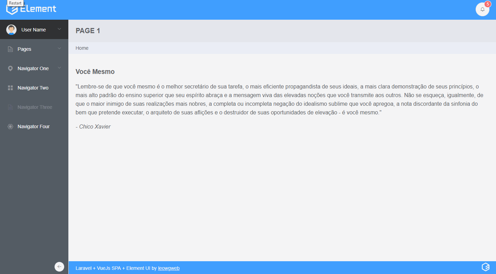

## Demo



## Requirements

- PHP >= 7.1.3
- NodeJs >= 8+ and NPM

## Features

- Laravel 5.7
- Vue + VueRouter + Vuex
- Lodash, Axios and JQuery lib
- [Element Desktop UI Library](https://element.eleme.io)
- 7 layouts type
- Custom Theme Color

## Installation

Dependencies Laravel
```
composer install
```

Dependecies FrontEnd
```
npm install
```

Rename file `.env.example` to `.env` and set your database connection details

Generate App Key
```
php artisan key:generate
```

Database Create

Open .env file and set database config
```
php artisan migrate
```

Start local server
```
php artisan serve
```

## Usage

### Development Mode

Build and watch
```
npm run watch
```

Serve with hot reloading
```
npm run hot
```

### Production Mode

```
npm run production
```

### Change layout type and theme color

For change the layout type, open the `App.vue` file and edit layout string dynamiq component.

For change the theme color, open the `resources/assets/js/sass/_element-variables.scss` file and uncomment the line 2 by inserting the color. 
If you wish to make a few more changes to the theme, [access the document](https://element.eleme.io/#/en-US/component/custom-theme). 
